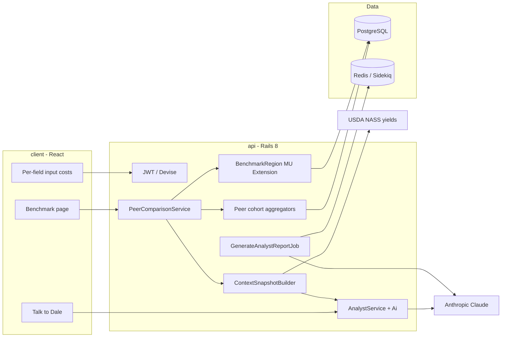

# Judge & AI-assisted code review

**Hackathon:** Problem #1 — Baseline: Farm Financial Planning

**Fieldmark** is a financial planning SaaS for mid-scale Midwest corn and soybean farmers. It addresses the lack of **independent** cost benchmarks when farmers commit to expensive seed, fertilizer, and chemical purchases — often with advisors or vendors who may have conflicts of interest.

---

## How Fieldmark answers the challenge

| What judges are looking for | How Fieldmark delivers |
|----------------------------|-------------------------|
| **Independent cost benchmarks** | Official **MU Extension 2026** crop budgets seeded into `benchmark_regions` — university planning defaults, not vendor quotes. See `api/docs/BENCHMARK_DATA.md`. |
| **Conflict of interest** | **D.A.L.E.** (Data Analytics for Land Economics) — an AI analyst with an explicit independence system prompt: no vendor, co-op, or agronomist relationships. Product copy: `client/src/constants/dale.js`. |
| **Per-field costs vs anonymized peer data** | Farmers enter **per-field** `input_costs` (seed, fertilizer, chemicals, labor). `POST …/scenarios/:id/compare` runs `PeerComparisonService`: your costs vs MU benchmarks **and** vs **anonymized regional peer cohorts** (median, percentiles, per-field breakdown). Minimum **5 farms** in cohort before peer stats are shown. |

### Three layers of comparison (industry + peers + AI)

1. **Industry baseline (independent)** — MU Extension operating costs per acre by region and commodity (`GET /api/v1/benchmarks`, `BenchmarkRegion`).
2. **Anonymized peer cohort** — Other Fieldmark farmers in the same region and commodity; aggregated medians and percentiles only — **never individual farm identities** (`PeerCohortSelector`, `PeerCohortAggregator`, `FieldPeerAggregator`).
3. **D.A.L.E. interpretation** — Claude receives a structured snapshot (`ContextSnapshotBuilder`) with benchmarks, peer cohort size, per-field gaps, scenario margins, and USDA NASS yield context so the farmer gets plain-language “ammunition” before March commitments.

**Demo the full loop:** sign in as `demo@fieldmark.app` → open a scenario → **Benchmarks** (`/scenarios/:id/benchmark`) after running **Compare**, or call `POST /api/v1/farms/:farm_id/scenarios/:id/compare`.

---

## Submission blurb (copy for hackathon form / README)

> **Fieldmark** — independent farm financial planning for Midwest corn and soybean farmers (Problem #1: Baseline).
>
> Farmers enter **per-field input costs**, then compare against two independent baselines before signing purchase agreements: (1) **MU Extension 2026** official crop budgets — university industry data, not vendor pricing — and (2) **anonymized, regionally aggregated peer farms** on Fieldmark (medians and percentiles; cohort size disclosed; no farm identities exposed). **D.A.L.E.** (Data Analytics for Land Economics) interprets benchmarks, peer gaps, and downside scenarios in plain language with **no ties to input vendors** — giving farmers fact-based leverage where advisors may have conflicts of interest. Supplementary **USDA NASS** yield context grounds scenario assumptions.
>
> **Stack:** Rails 8 API (`api/`), React farmer app (`client/`), docs site (`website/`). **AI reviewers:** read [`llm.txt`](../llm.txt) then this file. **Verify:** `./bin/dev` → `cd api && bin/rails demo:seed` → `api/bin/test_api`. **Demo:** `demo@fieldmark.app` / `password123` · API playground: `/developer`.

---

## Architecture



---

## Core user journey (maps to challenge)

1. Register / demo login → create **Farm** (region, commodity).
2. Add **Fields** → enter **InputCosts** per field per category (per-acre).
3. Create **Scenario** → **Calculate** margins (base + downside).
4. **Compare** — `PeerComparisonService` writes `peer_comparison` with MU benchmark + anonymized peer stats + per-field rows.
5. **Benchmarks UI** — side-by-side: your $/acre vs peer median vs Extension benchmark.
6. **Talk to Dale** — chat uses snapshot; cites cohort size, never names peer farms.
7. **Lender report** (async) — structured JSON report for advisors/lenders.

---

## Start here — file map

### Auth & security (user-scoped data)

| File | Purpose |
|------|---------|
| `api/app/controllers/api/v1/base_controller.rb` | JWT `authenticate_user!` |
| `api/app/controllers/api/v1/farms_controller.rb` | `current_user.farms` pattern |
| `api/.env.example` | Required env vars (no secrets committed) |

### Per-field costs

| File | Purpose |
|------|---------|
| `api/app/models/field.rb`, `input_cost.rb` | Field-level cost records |
| `api/app/controllers/api/v1/input_costs_controller.rb` | CRUD per field |
| `client/src/pages/InputCostsPage.jsx` | Farmer cost entry UI |

### Independent benchmarks (MU Extension)

| File | Purpose |
|------|---------|
| `api/app/models/benchmark_region.rb` | Seeded MU 2026 budgets |
| `api/db/seeds/benchmark_data.json` | Source data |
| `api/docs/BENCHMARK_DATA.md` | Scrape/seed pipeline, data lineage |
| `api/app/services/benchmark_region_finder.rb` | Region + commodity lookup |

### Anonymized peer comparison

| File | Purpose |
|------|---------|
| `api/app/services/peer_comparison_service.rb` | Orchestrates compare |
| `api/app/services/peer_cohort_selector.rb` | Same region/commodity; min 5 farms |
| `api/app/services/peer_cohort_aggregator.rb` | Medians, percentiles (anonymized) |
| `api/app/services/field_peer_aggregator.rb` | **Per-field** vs peer field medians |
| `api/app/controllers/api/v1/scenarios_controller.rb` | `POST …/compare` |
| `client/src/pages/BenchmarkPage.jsx` | Benchmark + peer UI |
| `api/docs/API.md` | `compare` request/response shape |

### D.A.L.E. (independent AI)

| File | Purpose |
|------|---------|
| `api/app/services/analyst_service.rb` | `SYSTEM_PROMPT` — no vendor ties |
| `api/app/services/context_snapshot_builder.rb` | Benchmark + peer cohort in every message |
| `api/app/services/analyst_report_generator_service.rb` | Lender report JSON |
| `api/app/services/ai.rb`, `ai_router.rb` | Claude gateway |
| `client/src/constants/dale.js` | In-app branding and copy |

### Industry context (USDA)

| File | Purpose |
|------|---------|
| `api/app/services/yield_context_service.rb` | NASS yield bands for scenarios |
| `api/db/seeds/usda_yield_data.json` | Seeded yield stats |

---

## Verify locally

```bash
# From repo root
./bin/dev

# Another terminal
cd api && bin/rails demo:seed
api/bin/test_api

# Optional: live AI + async report (needs REDIS_URL, api/bin/jobs, ANTHROPIC_API_KEY)
RUN_AI_SMOKE=1 api/bin/test_api
```

**Demo login:** `demo@fieldmark.app` / `password123` (or `POST /api/v1/auth/demo`)

**Key API call for the challenge:** `POST /api/v1/farms/:farm_id/scenarios/:id/compare` — exercises per-field costs, MU benchmarks, and peer cohort.

---

## Suggested prompts for AI reviewers

Paste these after loading `llm.txt` or cloning the repo:

1. **Challenge fit:** “How does Fieldmark satisfy Problem #1 — independent benchmarks, conflict-of-interest framing, and per-field vs anonymized peer comparison? Cite specific files.”

2. **Peer privacy:** “Trace `POST …/compare` from route to response. How is the peer cohort selected and anonymized? Is any other farm’s identity exposed?”

3. **Independence:** “Read `AnalystService::SYSTEM_PROMPT` and `dale.js`. What constraints prevent vendor recommendations?”

4. **Data sources:** “Distinguish MU Extension benchmark data from peer cohort data from USDA NASS data. Where is each loaded and used?”

5. **Security:** “Find `Farm.find(params[:id])` or other unscoped queries on user-owned resources.”

6. **End-to-end:** “Walk the demo seed path from login through compare to analyst chat context snapshot.”

---

## Related docs

- [`llm.txt`](../llm.txt) — API flows, endpoints, demo credentials
- [`README.md`](../README.md) — Run the full stack
- [`api/docs/API.md`](../api/docs/API.md) — Full API reference
- [`CLAUDE.md`](../CLAUDE.md) — D.A.L.E. branding
- [`tools/fieldmark/README.md`](../tools/fieldmark/README.md) — MCP for live API exploration
